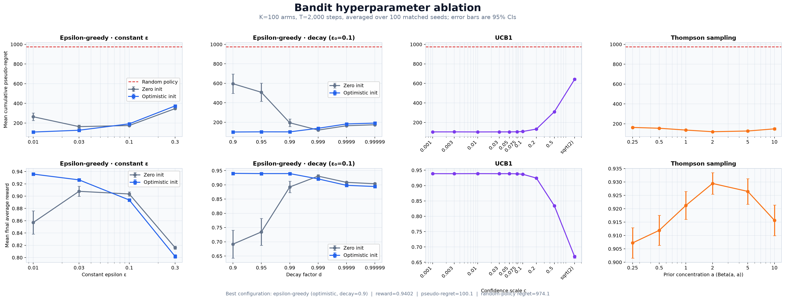

<h1 align="center">RL by Hand</h1>

<p align="center">
  <strong>Multi-armed bandit algorithms derived from the math and implemented from scratch.</strong>
  <br>
  No reinforcement-learning frameworks. Only NumPy, Matplotlib, and readable Python.
</p>

<p align="center">
  
  
  
  
</p>

<p align="center">
  <a href="#quick-start">Quick start</a> ·
  <a href="#algorithms">Algorithms</a> ·
  <a href="#evaluation">Evaluation</a> ·
  <a href="#project-layout">Project layout</a>
</p>

---

## Overview

This repository builds the core exploration–exploitation strategies for
**Bernoulli multi-armed bandits** directly from their mathematical definitions.
The implementations share the same interface, making it easy to inspect an
algorithm in isolation or compare policies over identical problem instances.

The environment contains $K$ arms. Each arm $i$ has an unknown success
probability $\mu_i \in [0,1]$. At time $t$, the agent chooses an arm $a_t$ and
observes a binary reward

$$
r_t \sim \mathrm{Bernoulli}\!\left(\mu_{a_t}\right).
$$

The objective is to learn which arm is best while collecting as much reward as
possible during the learning process.

<p align="center">
  
</p>

## Quick start

### Requirements

- Python 3.14 or newer
- [`uv`](https://docs.astral.sh/uv/) (recommended), or `pip`

### Install

With `uv`:

```bash
uv sync --locked
```

Alternatively, create a virtual environment and install the project with
`pip`:

```bash
python -m venv .venv
source .venv/bin/activate
python -m pip install -e .
```

### Run an algorithm

```bash
# Epsilon-greedy and its visualization
uv run python -m algorithms.epsilon_greedy

# UCB1
uv run python -m algorithms.ucb

# Thompson sampling
uv run python -m algorithms.thompson
```

If you installed with `pip`, omit the `uv run` prefix.

## Algorithms

| Algorithm | Exploration strategy | Main parameter |
| --- | --- | --- |
| **Epsilon-greedy** | Explore randomly with fixed or decaying probability | Exploration rate `epsilon` |
| **UCB1** | Add an uncertainty bonus to each value estimate | Confidence scale `c` |
| **Thompson sampling** | Sample from a Bayesian posterior for every arm | Beta prior |

### Epsilon-greedy

Epsilon-greedy explores uniformly at random with probability $\varepsilon$ and
otherwise chooses the arm with the highest current value estimate:

$$
a_t =
\begin{cases}
\text{a uniformly random arm},
  & \text{with probability } \varepsilon, \\
\displaystyle \underset{i \in \{1,\ldots,K\}}{\arg\max}\; \widehat{Q}_t(i),
  & \text{with probability } 1-\varepsilon.
\end{cases}
$$

After observing $r_t$, only the selected arm is updated. If $N_t(a_t)$ is its
number of pulls so far, the incremental sample-mean update is

$$
\widehat{Q}_{t+1}(a_t) = \widehat{Q}_t(a_t) + \frac{1}{N_t(a_t)}\left(r_t - \widehat{Q}_t(a_t)\right).
$$

This is algebraically equivalent to recomputing the empirical mean, but it
requires constant memory. Ties between equal estimates are broken uniformly at
random, so a block of equal estimates (for example every zero-initialized arm)
does not collapse onto the lowest-indexed arm.

The standalone demo in [`algorithms/epsilon_greedy.py`](algorithms/epsilon_greedy.py)
uses 1,000 arms, 1,000 steps, $\varepsilon=0.1$, and seed 67. It writes the
following dashboard to `images/bandit_results.png`:

<p align="center">
  
</p>

#### Decaying epsilon

A constant exploration rate continues to make random choices forever. An
exponential schedule gradually shifts the policy toward exploitation:

$$
\varepsilon_t = \varepsilon_0 d^t,
\qquad 0 < d < 1.
$$

Set `decay=True` and provide `decay_rate=d` to use this schedule.

#### Optimistic initialization

Instead of initializing every estimate to zero, optimistic initialization uses

$$
\widehat{Q}_0(i)=1
\qquad \text{for every arm } i.
$$

Because 1 is the largest possible Bernoulli mean, untried arms remain
attractive. This encourages broad early exploration even when $\varepsilon$ is
small. Enable it with `optimistic_initialization=True`.

### UCB1

UCB1 chooses the arm with the largest upper-confidence index: its empirical
value plus an exploration bonus.

$$
a_t = \underset{1 \le i \le K}{\arg\max}\left[\widehat{Q}_t(i) + c\sqrt{\frac{\ln t}{N_t(i)}}\right].
$$

The bonus is large for rarely selected arms and shrinks as evidence
accumulates. The confidence scale $c$ controls the strength of exploration.
[`algorithms/ucb.py`](algorithms/ucb.py) first pulls every arm once, avoiding
division by zero, and then applies the index above. Its standalone default is
$c=\sqrt{2}$; the comparison benchmark uses the ablation-tuned value
$c=0.01$.

> [!NOTE]
> UCB1 needs a horizon longer than the number of arms to move beyond its
> one-pull-per-arm initialization phase.

### Thompson sampling

For a Bernoulli bandit, Thompson sampling maintains a Beta posterior over each
unknown arm mean. Starting from a common prior
$\mathrm{Beta}(\alpha_0,\beta_0)$, the posterior after observing $S_i$
successes and $F_i$ failures is

$$
\mu_i \mid \mathcal{D}_t
\sim \mathrm{Beta}(S_i+\alpha_0,F_i+\beta_0).
$$

At every step, the policy samples one plausible mean per arm and selects the
largest:

$$
\widetilde{\mu}_i
\sim \mathrm{Beta}(S_i+\alpha_0,F_i+\beta_0),
\qquad
a_t = \underset{i \in \{1,\ldots,K\}}{\arg\max}\;\widetilde{\mu}_i.
$$

The observed reward updates the chosen arm's sufficient statistics:

$$
S_{a_t} \leftarrow S_{a_t}+r_t,
\qquad
F_{a_t} \leftarrow F_{a_t}+(1-r_t).
$$

This randomized posterior sampling naturally balances exploration and
exploitation. The implementation is in
[`algorithms/thompson.py`](algorithms/thompson.py). Its default
$\mathrm{Beta}(1,1)$ prior is uniform; `prior_alpha` and `prior_beta` expose
the prior mean and strength for controlled ablations.

## Evaluation

### Cumulative pseudo-regret

Let

$$
\mu^\star = \max_{i \in \{1,\ldots,K\}} \mu_i
$$

be the expected reward of the best arm. The experiments evaluate a policy with
cumulative pseudo-regret:

$$
R_T
= \sum_{t=1}^{T}\left(\mu^\star-\mu_{a_t}\right)
= T\mu^\star-\sum_{t=1}^{T}\mu_{a_t}.
$$

This metric compares expected arm rewards, so it is not distorted by lucky or
unlucky Bernoulli samples. **Lower regret is better.** The plots also report
running average reward, for which higher is better.

### Epsilon-greedy sweep

[`compare_bandits.py`](compare_bandits.py) compares constant epsilon against
six exponential decay rates, both with zero and optimistic initialization. Each
configuration is evaluated over 10 seeds on a grid of arm counts and horizons.

```bash
uv run python compare_bandits.py
```

The script prints a summary table, writes a timestamped
`comparison_YYYYMMDD_HHMMSS/summary.csv`, and refreshes
`images/comparison.png`.

<p align="center">
  
</p>

### Cross-algorithm benchmark

[`compare_algorithms.py`](compare_algorithms.py) compares these four policies
over 10 seeds:

1. Constant epsilon-greedy with $\varepsilon=0.1$
2. Optimistic epsilon-greedy with $\varepsilon=0.1$ and $d=0.90$
3. Thompson sampling with a $\mathrm{Beta}(1,1)$ prior
4. UCB1 with $c=0.01$

```bash
uv run python compare_algorithms.py
```

The script prints aggregate reward and regret statistics, writes a timestamped
`algorithm_comparison_YYYYMMDD_HHMMSS/summary.csv`, and refreshes
`images/algorithm_comparison.png`.

#### Unified hyperparameter ablation

[`compare_hyperparameters.py`](compare_hyperparameters.py) extends the existing
comparison workflow across the primary tuning knob for every policy family:

- Epsilon-greedy sweeps four constant epsilons and six decay factors (all with
  $\varepsilon_0=0.1$), each with zero and optimistic initialization.
- UCB1 sweeps ten confidence scales from `0.001` through `sqrt(2)`.
- Thompson sampling sweeps six symmetric `Beta(a, a)` priors, keeping the
  prior mean fixed at the correct value $0.5$ while the concentration varies.

Every configuration uses $K=100$ arms, $T=2{,}000$ steps, and the same 100
problem instances (seeds 0 through 99). Per-seed regrets are saved alongside
the aggregates, and every configuration is compared against the best one with
a paired, seed-matched 95% confidence interval.

```bash
uv run python compare_hyperparameters.py
```

The script follows the other comparison tools: it prints a ranked summary,
writes `hyperparameter_comparison_YYYYMMDD_HHMMSS/summary.csv` and
`per_seed.csv`, and refreshes `images/hyperparameter_comparison.png`.

Results are ranked by mean cumulative pseudo-regret. Reward cells report
mean ± standard deviation across seeds; regret cells report the mean with its
95% CI. **Bold rows form the top statistical group: their paired CI against
the best configuration includes zero.** The figure's dashed red line marks the
uniform-random policy (974.1 regret on these instances).

| Rank | Family | Configuration | Average reward ↑ | Pseudo-regret ↓ (95% CI) |
| ---: | --- | --- | ---: | ---: |
| **1** | **Epsilon-greedy** | **optimistic; `d=0.90`** | **0.9402 ± 0.0110** | **100.1 [97.4, 102.8]** |
| **2** | **Epsilon-greedy** | **optimistic; `d=0.99`** | **0.9395 ± 0.0105** | **101.5 [99.4, 103.6]** |
| 3 | Epsilon-greedy | optimistic; `d=0.95` | 0.9394 ± 0.0126 | 101.8 [98.8, 104.7] |
| **4** | **UCB1** | **`c=0.01`** | **0.9389 ± 0.0146** | **102.8 [99.5, 106.2]** |
| **5** | **UCB1** | **`c=0.001`** | **0.9388 ± 0.0144** | **103.2 [99.8, 106.6]** |
| **6** | **UCB1** | **`c=0.03`** | **0.9387 ± 0.0142** | **103.3 [100.0, 106.6]** |
| **7** | **UCB1** | **`c=0.05`** | **0.9388 ± 0.0143** | **103.3 [100.0, 106.7]** |
| **8** | **UCB1** | **`c=0.003`** | **0.9387 ± 0.0147** | **103.4 [99.9, 106.9]** |
| 9 | UCB1 | `c=0.075` | 0.9383 ± 0.0130 | 104.5 [101.8, 107.3] |
| 10 | UCB1 | `c=0.10` | 0.9368 ± 0.0132 | 107.6 [104.4, 110.8] |
| 11 | Epsilon-greedy | optimistic; constant `eps=0.01` | 0.9359 ± 0.0111 | 108.5 [106.2, 110.8] |
| 12 | Epsilon-greedy | zero-init; `d=0.999` | 0.9305 ± 0.0261 | 119.6 [109.8, 129.4] |
| 13 | Thompson sampling | `Beta(2,2)` | 0.9294 ± 0.0202 | 119.9 [114.4, 125.5] |
| 14 | Epsilon-greedy | optimistic; constant `eps=0.03` | 0.9265 ± 0.0120 | 126.8 [124.4, 129.2] |
| 15 | Thompson sampling | `Beta(5,5)` | 0.9265 ± 0.0241 | 127.1 [118.1, 136.0] |
| 16 | UCB1 | `c=0.20` | 0.9244 ± 0.0117 | 132.2 [129.3, 135.2] |
| 17 | Thompson sampling | `Beta(1,1)` | 0.9212 ± 0.0262 | 136.5 [129.5, 143.6] |
| 18 | Epsilon-greedy | optimistic; `d=0.999` | 0.9208 ± 0.0137 | 138.1 [134.4, 141.9] |
| 19 | Thompson sampling | `Beta(10,10)` | 0.9157 ± 0.0290 | 148.8 [137.7, 159.9] |
| 20 | Thompson sampling | `Beta(0.5,0.5)` | 0.9119 ± 0.0283 | 155.0 [147.6, 162.3] |
| 21 | Thompson sampling | `Beta(0.25,0.25)` | 0.9072 ± 0.0286 | 163.0 [155.1, 171.0] |
| 22 | Epsilon-greedy | zero-init; constant `eps=0.03` | 0.9078 ± 0.0409 | 163.6 [147.1, 180.2] |
| 23 | Epsilon-greedy | zero-init; `d=0.9999` | 0.9086 ± 0.0181 | 164.4 [158.1, 170.7] |
| 24 | Epsilon-greedy | zero-init; `d=0.99999` | 0.9038 ± 0.0182 | 174.6 [168.5, 180.7] |
| 25 | Epsilon-greedy | zero-init; constant `eps=0.1` | 0.9035 ± 0.0176 | 174.7 [169.0, 180.4] |
| 26 | Epsilon-greedy | optimistic; `d=0.9999` | 0.8982 ± 0.0117 | 182.8 [179.9, 185.7] |
| 27 | Epsilon-greedy | optimistic; `d=0.99999` | 0.8941 ± 0.0116 | 191.3 [188.3, 194.2] |
| 28 | Epsilon-greedy | optimistic; constant `eps=0.1` | 0.8937 ± 0.0117 | 191.9 [189.0, 194.8] |
| 29 | Epsilon-greedy | zero-init; `d=0.99` | 0.8924 ± 0.1015 | 194.9 [155.9, 234.0] |
| 30 | Epsilon-greedy | zero-init; constant `eps=0.01` | 0.8570 ± 0.0954 | 264.0 [226.1, 301.8] |
| 31 | UCB1 | `c=0.50` | 0.8343 ± 0.0137 | 309.4 [304.9, 313.8] |
| 32 | Epsilon-greedy | zero-init; constant `eps=0.3` | 0.8161 ± 0.0134 | 346.6 [341.9, 351.2] |
| 33 | Epsilon-greedy | optimistic; constant `eps=0.3` | 0.8020 ± 0.0143 | 373.8 [368.8, 378.9] |
| 34 | Epsilon-greedy | zero-init; `d=0.95` | 0.7345 ± 0.2378 | 507.9 [413.8, 602.0] |
| 35 | Epsilon-greedy | zero-init; `d=0.90` | 0.6917 ± 0.2474 | 595.8 [497.1, 694.5] |
| 36 | UCB1 | `c=sqrt(2)` | 0.6683 ± 0.0235 | 642.3 [633.1, 651.5] |

<p align="center">
  
</p>

The top statistical group — optimistic epsilon-greedy with fast decay and
UCB1 with $c \le 0.05$ — is statistically indistinguishable, and every member
reduces to "give each arm about one pull, then commit": with $d=0.90$ the
expected number of random exploration pulls is
$\sum_t 0.1 \cdot 0.9^t \approx 1$, so the optimistic initialization performs
essentially all of the exploration, while UCB1 with $c \le 0.05$ behaves like
its one-pull-per-arm bootstrap followed by greedy exploitation. Extending the
UCB grid below $c=0.01$ shows the regret curve is flat as $c \to 0$, so the
optimum is a small-$c$ plateau rather than a grid-boundary artifact.

Among constant schedules, optimistic initialization prefers the smallest
epsilon (`eps=0.01`, regret 108.5) because the optimistic values already
supply the exploration, while zero initialization peaks at `eps=0.03`: too
little constant exploration lets zero-initialized estimates lock onto a lucky
early arm, and too much wastes pulls. Zero initialization with fast decay
remains catastrophic for the same reason — once epsilon vanishes, random
tie-breaking among equal estimates is the only exploration left, which is also
why those rows carry the largest confidence intervals.

The symmetric Thompson sweep is unimodal in concentration: `Beta(2,2)` is
best, weaker priors over-explore, and stronger priors (through `Beta(10,10)`)
under-explore. For scale, the uniform-random policy scores 974.1 regret on
the same instances, so every tested configuration learns far better than
random.

> [!IMPORTANT]
> These rankings are specific to a Bernoulli bandit with $T/K=20$. The table
> identifies strong settings for this experiment, not universal defaults.

## Using the implementations

Every runner returns the same result dictionary:

```python
from algorithms.thompson import run_thompson

results = run_thompson(
    n_arms=20,
    n_steps=5_000,
    seed=67,
    prior_alpha=2.0,
    prior_beta=2.0,
)

rewards = results["rewards"]
selected_arms = results["selected_arms"]
true_probs = results["true_probs"]
estimated_values = results["estimated_values"]
total_pulls = results["total_pulls"]
```

The shared shape makes custom analyses and side-by-side experiments
straightforward.

## Project layout

```text
.
├── algorithms/
│   ├── epsilon_greedy.py    # Constant/decaying epsilon + optimistic values
│   ├── thompson.py          # Beta–Bernoulli Thompson sampling
│   └── ucb.py               # Upper Confidence Bound (UCB1)
├── images/                    # Figures displayed in this README
├── bandit_utils.py            # Metrics and multi-seed averaging
├── compare_algorithms.py      # Cross-algorithm benchmark
├── compare_bandits.py         # Epsilon schedule and initialization sweep
├── compare_hyperparameters.py # Unified policy hyperparameter ablation
├── visualizations.py          # Reusable plotting dashboard
├── pyproject.toml             # Project metadata and dependencies
└── uv.lock                    # Reproducible dependency lockfile
```

## Reproducibility

Standalone examples use seed 67. The grid comparison scripts average each
configuration over seeds 0 through 9, while `compare_hyperparameters.py` uses
seeds 0 through 99 for a lower-variance focused ablation and additionally
saves per-seed outcomes with paired 95% confidence intervals. Every comparison
evaluates policies on matching Bernoulli problem instances. Runtime settings,
including arm counts, horizons, decay rates, confidence scales, and Beta
priors, are declared near the top of each script so experiments are easy to
inspect and modify.
