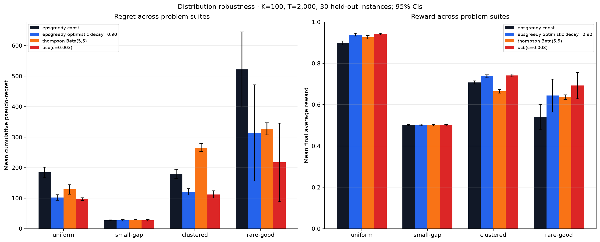

<h1 align="center">RL by Hand</h1>

<p align="center">
  <strong>Multi-armed bandit algorithms derived from the math and implemented from scratch.</strong>
  <br>
  No reinforcement-learning frameworks. Only NumPy, Matplotlib, and readable Python.
</p>

<p align="center">
  
  
  
  
</p>

<p align="center">
  <a href="#quick-start">Quick start</a> ·
  <a href="#algorithms">Algorithms</a> ·
  <a href="#evaluation">Evaluation</a> ·
  <a href="#project-layout">Project layout</a>
</p>

---

## Overview

This repository builds the core exploration–exploitation strategies for
**Bernoulli multi-armed bandits** directly from their mathematical definitions.
The implementations share the same interface, making it easy to inspect an
algorithm in isolation or compare policies over identical problem instances.

The environment contains $K$ arms. Each arm $i$ has an unknown success
probability $\mu_i \in [0,1]$. At time $t$, the agent chooses an arm $a_t$ and
observes a binary reward

$$
r_t \sim \mathrm{Bernoulli}\!\left(\mu_{a_t}\right).
$$

The objective is to learn which arm is best while collecting as much reward as
possible during the learning process.

<p align="center">
  
</p>

## Quick start

### Requirements

- Python 3.12 or newer
- [`uv`](https://docs.astral.sh/uv/) (recommended), or `pip`

### Install

With `uv`:

```bash
uv sync --locked
```

Alternatively, create a virtual environment and install the project with
`pip`:

```bash
python -m venv .venv
source .venv/bin/activate
python -m pip install -e .
```

### Run an algorithm

```bash
# Epsilon-greedy and its visualization
uv run python -m algorithms.epsilon_greedy

# UCB1
uv run python -m algorithms.ucb

# Thompson sampling
uv run python -m algorithms.thompson
```

If you installed with `pip`, omit the `uv run` prefix.

## Algorithms

| Algorithm | Exploration strategy | Main parameter |
| --- | --- | --- |
| **Epsilon-greedy** | Explore randomly with fixed or decaying probability | Exploration rate `epsilon` |
| **UCB(c)** | Add an uncertainty bonus to each value estimate | Confidence scale `c` |
| **Thompson sampling** | Sample from a Bayesian posterior for every arm | Beta prior |

### Epsilon-greedy

Epsilon-greedy explores uniformly at random with probability $\varepsilon$ and
otherwise chooses the arm with the highest current value estimate:

$$
a_t =
\begin{cases}
\text{a uniformly random arm},
  & \text{with probability } \varepsilon, \\
\displaystyle \underset{i \in \{1,\ldots,K\}}{\arg\max}\; \widehat{Q}_t(i),
  & \text{with probability } 1-\varepsilon.
\end{cases}
$$

After observing $r_t$, only the selected arm is updated. If $N_t(a_t)$ is its
number of pulls so far, the incremental sample-mean update is

$$
\widehat{Q}_{t+1}(a_t) = \widehat{Q}_t(a_t) + \frac{1}{N_t(a_t)}\left(r_t - \widehat{Q}_t(a_t)\right).
$$

This is algebraically equivalent to recomputing the empirical mean, but it
requires constant memory. Ties between equal estimates are broken uniformly at
random, so a block of equal estimates (for example every zero-initialized arm)
does not collapse onto the lowest-indexed arm.

The standalone demo in [`algorithms/epsilon_greedy.py`](algorithms/epsilon_greedy.py)
uses 1,000 arms, 1,000 steps, $\varepsilon=0.1$, and seed 67. It writes the
following dashboard to `images/bandit_results.png`:

<p align="center">
  
</p>

#### Decaying epsilon

A constant exploration rate continues to make random choices forever. An
exponential schedule gradually shifts the policy toward exploitation:

$$
\varepsilon_t = \varepsilon_0 d^t,
\qquad 0 < d < 1.
$$

Set `decay=True` and provide `decay_rate=d` to use this schedule.

#### Optimistic initialization

Instead of initializing every estimate to zero, optimistic initialization uses

$$
\widehat{Q}_0(i)=1
\qquad \text{for every arm } i.
$$

Because 1 is the largest possible Bernoulli mean, untried arms remain
attractive. This encourages broad early exploration even when $\varepsilon$ is
small. Enable it with `optimistic_initialization=True`.

### UCB(c) and UCB1

The parameterized UCB policy chooses the arm with the largest upper-confidence index: its empirical
value plus an exploration bonus.

$$
a_t = \underset{1 \le i \le K}{\arg\max}\left[\widehat{Q}_t(i) + c\sqrt{\frac{\ln t}{N_t(i)}}\right].
$$

The bonus is large for rarely selected arms and shrinks as evidence
accumulates. The confidence scale $c$ controls the strength of exploration.
[`algorithms/ucb.py`](algorithms/ucb.py) first pulls every arm once, avoiding
division by zero, and then applies the index above. Its standalone default is
$c=\sqrt{2}$, which is the classic UCB1 coefficient for this formula. The
comparison benchmark labels tuned alternatives such as $c=0.01$ as UCB(c),
because they do not carry the classic UCB1 guarantee.

> [!NOTE]
> UCB1 needs a horizon longer than the number of arms to move beyond its
> one-pull-per-arm initialization phase.

### Thompson sampling

For a Bernoulli bandit, Thompson sampling maintains a Beta posterior over each
unknown arm mean. Starting from a common prior
$\mathrm{Beta}(\alpha_0,\beta_0)$, the posterior after observing $S_i$
successes and $F_i$ failures is

$$
\mu_i \mid \mathcal{D}_t
\sim \mathrm{Beta}(S_i+\alpha_0,F_i+\beta_0).
$$

At every step, the policy samples one plausible mean per arm and selects the
largest:

$$
\widetilde{\mu}_i
\sim \mathrm{Beta}(S_i+\alpha_0,F_i+\beta_0),
\qquad
a_t = \underset{i \in \{1,\ldots,K\}}{\arg\max}\;\widetilde{\mu}_i.
$$

The observed reward updates the chosen arm's sufficient statistics:

$$
S_{a_t} \leftarrow S_{a_t}+r_t,
\qquad
F_{a_t} \leftarrow F_{a_t}+(1-r_t).
$$

This randomized posterior sampling naturally balances exploration and
exploitation. The implementation is in
[`algorithms/thompson.py`](algorithms/thompson.py). Its default
$\mathrm{Beta}(1,1)$ prior is uniform; `prior_alpha` and `prior_beta` expose
the prior mean and strength for controlled ablations.

## Evaluation

### Cumulative pseudo-regret

Let

$$
\mu^\star = \max_{i \in \{1,\ldots,K\}} \mu_i
$$

be the expected reward of the best arm. The experiments evaluate a policy with
cumulative pseudo-regret:

$$
R_T
= \sum_{t=1}^{T}\left(\mu^\star-\mu_{a_t}\right)
= T\mu^\star-\sum_{t=1}^{T}\mu_{a_t}.
$$

This metric compares expected arm rewards, so it is not distorted by lucky or
unlucky Bernoulli samples. **Lower regret is better.** The plots also report
running average reward, for which higher is better.

### Epsilon-greedy sweep

[`compare_bandits.py`](compare_bandits.py) compares constant epsilon against
six exponential decay rates, both with zero and optimistic initialization. Each
configuration is evaluated over 30 held-out problem instances on a grid of arm
counts and horizons. Shaded regions in the figure are 95% confidence intervals.

```bash
uv run python compare_bandits.py
```

The script prints a summary table, writes aggregate, per-instance, and
provenance files under `results/epsilon_sweep/`, and refreshes
`images/comparison.png`. The figure explicitly plots the longest configured
horizon; all horizons remain available in the CSV.

<p align="center">
  
</p>

### Cross-algorithm benchmark

[`compare_algorithms.py`](compare_algorithms.py) compares these four policies
over 30 held-out instances that are disjoint from hyperparameter tuning:

1. Constant epsilon-greedy with $\varepsilon=0.1$
2. Tuning-selected optimistic epsilon-greedy with $\varepsilon=0.1$ and $d=0.90$
3. Tuning-selected Thompson sampling with a $\mathrm{Beta}(5,5)$ prior
4. Tuning-selected UCB(c) with $c=0.003$

```bash
uv run python compare_algorithms.py
```

The script writes aggregate metrics, per-instance outcomes, and a provenance
manifest under `results/algorithm_comparison/`, then refreshes
`images/algorithm_comparison.png` with 95% confidence bands.

### Distribution robustness

[`compare_problem_suites.py`](compare_problem_suites.py) evaluates the same
policies on four held-out arm-mean suites: uniform, small-gap, clustered, and
rare-good. This makes distribution sensitivity visible instead of treating the
Uniform(0,1) ranking as universal.

```bash
uv run python compare_problem_suites.py
```

<p align="center">
  
</p>

#### Unified hyperparameter tuning and confirmation

[`compare_hyperparameters.py`](compare_hyperparameters.py) extends the existing
comparison workflow across the primary tuning knob for every policy family:

- Epsilon-greedy sweeps four constant epsilons and six decay factors (all with
  $\varepsilon_0=0.1$), each with zero and optimistic initialization.
- UCB(c) sweeps ten confidence scales from `0.001` through the classic
  UCB1 value `sqrt(2)`.
- Thompson sampling sweeps six symmetric `Beta(a, a)` priors, keeping the
  prior mean fixed at the correct value $0.5$ while the concentration varies.

Every configuration uses $K=100$ arms and $T=2{,}000$ steps. Seeds 0–99 form
the tuning set. The selected reference is then evaluated on a disjoint
confirmation set, seeds 10,000–10,099. Comparisons to that fixed reference use
paired, studentized max-t bootstrap intervals that control family-wise error
across the complete grid.

```bash
uv run python compare_hyperparameters.py
```

The script writes tuning and held-out summaries, both per-instance datasets,
and a machine-readable provenance manifest under
`results/hyperparameter_comparison/`. Rankings in `summary.csv` describe the
held-out set; `delta_ci95_*` columns are simultaneous intervals relative to
the tuning-selected reference. A confidence interval containing zero is
reported only as “not detectably different,” not as proof of equivalence.

The following table reports the fresh held-out results over 100 problem
instances. Reward is the mean ± sample standard deviation; the regret interval
is a marginal 95% confidence interval. The final column is the paired regret
difference from the tuning-selected reference with a simultaneous 95% max-t
interval; positive values favor the reference.

| Rank | Family | Configuration | Average reward ↑ | Pseudo-regret ↓ (95% CI) | Δ vs selected ↓ (simultaneous 95% CI) |
| ---: | --- | --- | ---: | ---: | ---: |
| 1 | UCB(c) | `c=0.001` | 0.9416 ± 0.0096 | 98.5 [96.6, 100.5] | -0.3 [-1.1, +0.5] |
| 2 | UCB(c) | `c=0.01` | 0.9414 ± 0.0101 | 98.7 [96.9, 100.5] | -0.1 [-1.9, +1.6] |
| 3 | UCB(c) | `c=0.003` (selected on tuning set) | 0.9414 ± 0.0101 | 98.8 [96.9, 100.8] | +0.0 [+0.0, +0.0] |
| 4 | UCB(c) | `c=0.03` | 0.9412 ± 0.0100 | 99.3 [97.5, 101.1] | +0.5 [-1.2, +2.1] |
| 5 | UCB(c) | `c=0.05` | 0.9409 ± 0.0102 | 100.1 [98.2, 102.0] | +1.3 [-0.7, +3.3] |
| 6 | UCB(c) | `c=0.075` | 0.9404 ± 0.0097 | 101.1 [99.2, 102.9] | +2.2 [+0.6, +3.9] |
| 7 | Epsilon-greedy | optimistic, `d=0.95` | 0.9401 ± 0.0122 | 101.6 [99.3, 103.9] | +2.8 [-1.6, +7.1] |
| 8 | Epsilon-greedy | optimistic, `d=0.90` | 0.9398 ± 0.0124 | 102.3 [99.9, 104.8] | +3.5 [-1.0, +8.0] |
| 9 | UCB(c) | `c=0.1` | 0.9389 ± 0.0096 | 103.9 [102.2, 105.7] | +5.1 [+2.6, +7.6] |
| 10 | Epsilon-greedy | optimistic, `d=0.99` | 0.9384 ± 0.0129 | 104.4 [101.6, 107.2] | +5.6 [+0.8, +10.3] |
| 11 | Epsilon-greedy | optimistic, constant `eps=0.01` | 0.9351 ± 0.0129 | 111.3 [108.3, 114.3] | +12.4 [+7.6, +17.3] |
| 12 | Thompson sampling | `Beta(2,2)` | 0.9311 ± 0.0204 | 120.6 [115.1, 126.1] | +21.8 [+12.7, +30.8] |
| 13 | Epsilon-greedy | zero-init, `d=0.999` | 0.9288 ± 0.0310 | 125.5 [113.8, 137.2] | +26.7 [+8.2, +45.2] |
| 14 | Thompson sampling | `Beta(5,5)` | 0.9284 ± 0.0278 | 126.9 [116.8, 136.9] | +28.0 [+12.1, +43.9] |
| 15 | Epsilon-greedy | optimistic, constant `eps=0.03` | 0.9252 ± 0.0138 | 131.5 [128.6, 134.5] | +32.7 [+27.9, +37.6] |
| 16 | UCB(c) | `c=0.2` | 0.9248 ± 0.0102 | 132.8 [130.1, 135.4] | +33.9 [+30.3, +37.6] |
| 17 | Epsilon-greedy | optimistic, `d=0.999` | 0.9219 ± 0.0119 | 138.6 [136.4, 140.9] | +39.8 [+35.6, +44.0] |
| 18 | Thompson sampling | `Beta(1,1)` | 0.9207 ± 0.0250 | 141.4 [134.8, 148.0] | +42.6 [+31.6, +53.5] |
| 19 | Epsilon-greedy | zero-init, constant `eps=0.03` | 0.9133 ± 0.0432 | 155.3 [138.7, 172.0] | +56.5 [+30.1, +82.9] |
| 20 | Thompson sampling | `Beta(0.5,0.5)` | 0.9132 ± 0.0293 | 155.5 [146.9, 164.0] | +56.6 [+42.5, +70.8] |
| 21 | Thompson sampling | `Beta(0.25,0.25)` | 0.9081 ± 0.0287 | 164.9 [156.9, 172.9] | +66.0 [+53.2, +78.9] |
| 22 | Epsilon-greedy | zero-init, `d=0.9999` | 0.9071 ± 0.0210 | 167.6 [160.1, 175.1] | +68.7 [+56.7, +80.8] |
| 23 | Thompson sampling | `Beta(10,10)` | 0.9057 ± 0.0332 | 170.4 [158.0, 182.8] | +71.6 [+51.7, +91.4] |
| 24 | Epsilon-greedy | zero-init, `d=0.99999` | 0.9021 ± 0.0234 | 178.5 [170.1, 186.9] | +79.7 [+66.2, +93.2] |
| 25 | Epsilon-greedy | zero-init, constant `eps=0.1` | 0.9015 ± 0.0231 | 179.8 [171.4, 188.3] | +81.0 [+67.5, +94.4] |
| 26 | Epsilon-greedy | optimistic, `d=0.9999` | 0.8981 ± 0.0130 | 186.4 [183.5, 189.3] | +87.6 [+82.5, +92.6] |
| 27 | Epsilon-greedy | optimistic, `d=0.99999` | 0.8944 ± 0.0120 | 193.1 [190.3, 195.9] | +94.3 [+89.5, +99.0] |
| 28 | Epsilon-greedy | optimistic, constant `eps=0.1` | 0.8941 ± 0.0121 | 194.2 [191.4, 197.1] | +95.4 [+90.6, +100.2] |
| 29 | Epsilon-greedy | zero-init, `d=0.99` | 0.8928 ± 0.1011 | 197.5 [157.1, 238.0] | +98.7 [+35.0, +162.4] |
| 30 | Epsilon-greedy | zero-init, constant `eps=0.01` | 0.8628 ± 0.0854 | 257.2 [223.3, 291.1] | +158.4 [+105.4, +211.4] |
| 31 | UCB(c) | `c=0.5` | 0.8340 ± 0.0133 | 315.0 [310.3, 319.6] | +216.1 [+208.9, +223.3] |
| 32 | Epsilon-greedy | zero-init, constant `eps=0.3` | 0.8139 ± 0.0155 | 354.8 [350.0, 359.6] | +256.0 [+247.5, +264.5] |
| 33 | Epsilon-greedy | optimistic, constant `eps=0.3` | 0.8012 ± 0.0147 | 378.9 [374.2, 383.6] | +280.1 [+272.2, +287.9] |
| 34 | Epsilon-greedy | zero-init, `d=0.95` | 0.7722 ± 0.2017 | 441.5 [360.5, 522.5] | +342.7 [+215.2, +470.2] |
| 35 | Epsilon-greedy | zero-init, `d=0.90` | 0.7042 ± 0.2278 | 576.3 [485.1, 667.5] | +477.5 [+334.0, +620.9] |
| 36 | UCB(c) | `c=sqrt(2)` | 0.6671 ± 0.0254 | 648.1 [638.6, 657.6] | +549.3 [+533.8, +564.7] |

<p align="center">
  
</p>

The tuning set selected UCB(c) with `c=0.003`. On held-out instances its mean
pseudo-regret is 98.8; `c=0.001` ranks first at 98.5, but its simultaneous
difference interval versus the fixed reference is `[-1.1, 0.5]`. The data
therefore do not detect a difference between those settings; they do not prove
the settings equivalent.

> [!IMPORTANT]
> These rankings are specific to independent arm means drawn from
> $\mathrm{Uniform}(0,1)$, Bernoulli rewards, and $T/K=20$. They are finite-
> horizon experimental settings, not universal defaults or theoretical policy
> recommendations. Consult the distribution-robustness benchmark before
> generalizing the result.

## Using the implementations

Every runner returns the same result dictionary:

```python
from algorithms.thompson import run_thompson

results = run_thompson(
    n_arms=20,
    n_steps=5_000,
    seed=67,
    prior_alpha=2.0,
    prior_beta=2.0,
)

rewards = results["rewards"]
selected_arms = results["selected_arms"]
true_probs = results["true_probs"]
estimated_values = results["estimated_values"]
total_pulls = results["total_pulls"]
```

The shared shape makes custom analyses and side-by-side experiments
straightforward. For controlled comparisons, pass the same explicit
`true_probs` array to every runner and provide separate `policy_seed` and
`reward_seed` values. The benchmark helpers do this automatically.

## Project layout

```text
.
├── algorithms/
│   ├── epsilon_greedy.py    # Constant/decaying epsilon + optimistic values
│   ├── thompson.py          # Beta–Bernoulli Thompson sampling
│   ├── ucb.py               # Parameterized UCB; sqrt(2) is classic UCB1
│   └── _common.py           # Validation and independent RNG streams
├── images/                    # Figures displayed in this README
├── results/                   # Canonical CSVs and provenance manifests
├── tests/                     # Correctness, validation, and inference tests
├── .github/workflows/ci.yml   # Locked install, lint, tests, and package build
├── bandit_utils.py            # Metrics, instances, aggregation, provenance
├── compare_algorithms.py      # Cross-algorithm benchmark
├── compare_bandits.py         # Epsilon schedule and initialization sweep
├── compare_hyperparameters.py # Unified policy hyperparameter ablation
├── compare_problem_suites.py  # Robustness across arm-mean distributions
├── visualizations.py          # Reusable plotting dashboard
├── pyproject.toml             # Project metadata and dependencies
└── uv.lock                    # Reproducible dependency lockfile
```

## Reproducibility

Standalone examples use master seed 67. Each master seed is split into
independent environment, policy, and reward streams. Benchmarks generate arm
means explicitly and use common reward streams, so matching does not depend on
algorithms consuming random numbers in the same order.

Hyperparameters are tuned on environment seeds 0–99 and confirmed on disjoint
seeds 10,000–10,099. The broader grid comparisons use held-out seeds
20,000–20,029. Canonical result directories contain aggregate CSVs,
per-instance outcomes, and manifests recording the full settings, software
versions, arm distribution, and a SHA-256 digest of the source and lockfile.

## References

- Peter Auer, Nicolò Cesa-Bianchi, and Paul Fischer, [“Finite-time Analysis of
  the Multiarmed Bandit Problem”](https://doi.org/10.1023/A:1013689704352),
  *Machine Learning*, 2002.
- William R. Thompson, [“On the Likelihood that One Unknown Probability Exceeds
  Another in View of the Evidence of Two Samples”](https://doi.org/10.1093/biomet/25.3-4.285),
  *Biometrika*, 1933.
