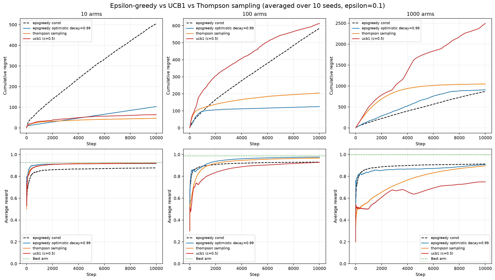
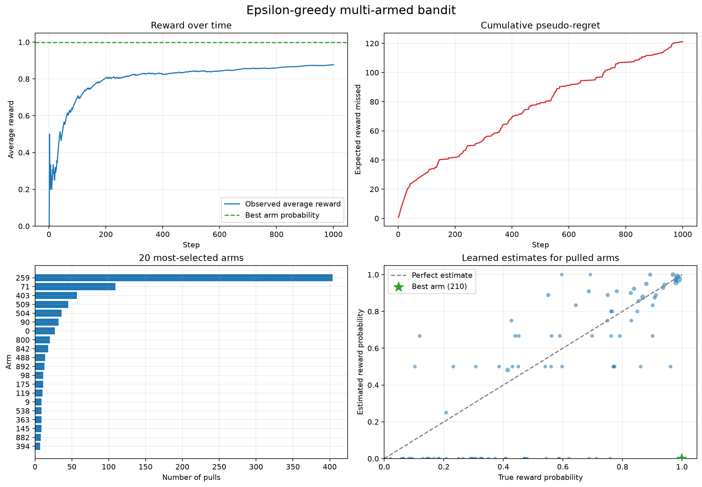
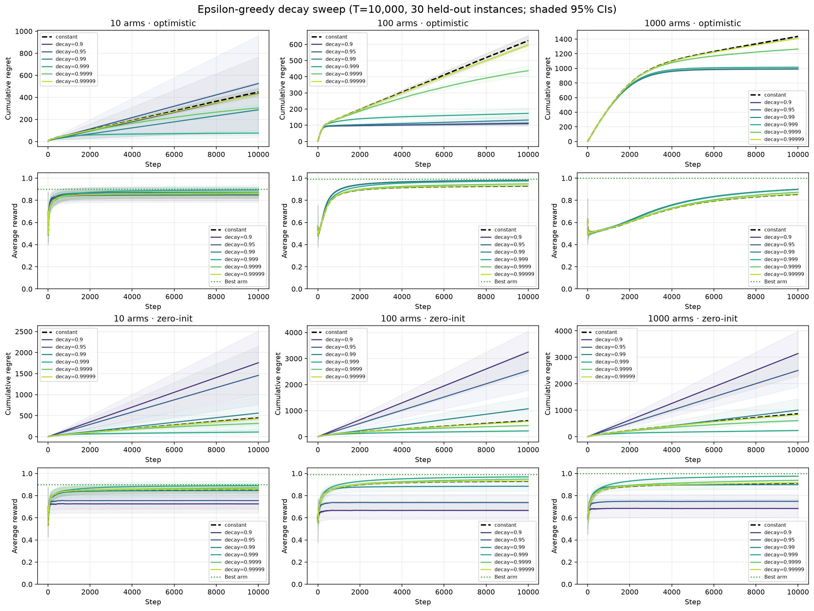

<h1 align="center">RL by Hand</h1>

<p align="center">
  <strong>Multi-armed bandit algorithms derived from the math and implemented from scratch.</strong>
  <br>
  No reinforcement-learning frameworks. Only NumPy, Matplotlib, and readable Python.
</p>

<p align="center">
  
  
  
  
</p>

<p align="center">
  <a href="#quick-start">Quick start</a> ·
  <a href="#algorithms">Algorithms</a> ·
  <a href="#evaluation">Evaluation</a> ·
  <a href="#project-layout">Project layout</a>
</p>

---

## Overview

This repository builds the core exploration–exploitation strategies for
**Bernoulli multi-armed bandits** directly from their mathematical definitions.
The implementations share the same interface, making it easy to inspect an
algorithm in isolation or compare policies over identical problem instances.

The environment contains $K$ arms. Each arm $i$ has an unknown success
probability $\mu_i \in [0,1]$. At time $t$, the agent chooses an arm $a_t$ and
observes a binary reward

$$
r_t \sim \mathrm{Bernoulli}\!\left(\mu_{a_t}\right).
$$

The objective is to learn which arm is best while collecting as much reward as
possible during the learning process.

<p align="center">
  
</p>

## Quick start

### Requirements

- Python 3.14 or newer
- [`uv`](https://docs.astral.sh/uv/) (recommended), or `pip`

### Install

With `uv`:

```bash
uv sync --locked
```

Alternatively, create a virtual environment and install the project with
`pip`:

```bash
python -m venv .venv
source .venv/bin/activate
python -m pip install -e .
```

### Run an algorithm

```bash
# Epsilon-greedy and its visualization
uv run python -m algorithms.epsilon_greedy

# UCB1
uv run python -m algorithms.ucb

# Thompson sampling
uv run python -m algorithms.thompson
```

If you installed with `pip`, omit the `uv run` prefix.

## Algorithms

| Algorithm | Exploration strategy | Main parameter |
| --- | --- | --- |
| **Epsilon-greedy** | Explore randomly with fixed or decaying probability | Exploration rate `epsilon` |
| **UCB1** | Add an uncertainty bonus to each value estimate | Confidence scale `c` |
| **Thompson sampling** | Sample from a Bayesian posterior for every arm | Beta prior |

### Epsilon-greedy

Epsilon-greedy explores uniformly at random with probability $\varepsilon$ and
otherwise chooses the arm with the highest current value estimate:

$$
a_t =
\begin{cases}
\text{a uniformly random arm},
  & \text{with probability } \varepsilon, \\
\displaystyle \underset{i \in \{1,\ldots,K\}}{\arg\max}\; \widehat{Q}_t(i),
  & \text{with probability } 1-\varepsilon.
\end{cases}
$$

After observing $r_t$, only the selected arm is updated. If $N_t(a_t)$ is its
number of pulls so far, the incremental sample-mean update is

$$
\widehat{Q}_{t+1}(a_t) = \widehat{Q}_t(a_t) + \frac{1}{N_t(a_t)}\left(r_t - \widehat{Q}_t(a_t)\right).
$$

This is algebraically equivalent to recomputing the empirical mean, but it
requires constant memory.

The standalone demo in [`algorithms/epsilon_greedy.py`](algorithms/epsilon_greedy.py)
uses 1,000 arms, 1,000 steps, $\varepsilon=0.1$, and seed 67. It writes the
following dashboard to `images/bandit_results.png`:

<p align="center">
  
</p>

#### Decaying epsilon

A constant exploration rate continues to make random choices forever. An
exponential schedule gradually shifts the policy toward exploitation:

$$
\varepsilon_t = \varepsilon_0 d^t,
\qquad 0 < d < 1.
$$

Set `decay=True` and provide `decay_rate=d` to use this schedule.

#### Optimistic initialization

Instead of initializing every estimate to zero, optimistic initialization uses

$$
\widehat{Q}_0(i)=1
\qquad \text{for every arm } i.
$$

Because 1 is the largest possible Bernoulli mean, untried arms remain
attractive. This encourages broad early exploration even when $\varepsilon$ is
small. Enable it with `optimistic_initialization=True`.

### UCB1

UCB1 chooses the arm with the largest upper-confidence index: its empirical
value plus an exploration bonus.

$$
a_t = \underset{1 \le i \le K}{\arg\max}\left[\widehat{Q}_t(i) + c\sqrt{\frac{\ln t}{N_t(i)}}\right].
$$

The bonus is large for rarely selected arms and shrinks as evidence
accumulates. The confidence scale $c$ controls the strength of exploration.
[`algorithms/ucb.py`](algorithms/ucb.py) first pulls every arm once, avoiding
division by zero, and then applies the index above. Its standalone default is
$c=\sqrt{2}$; the comparison benchmark uses the tuned value $c=0.5$.

> [!NOTE]
> UCB1 needs a horizon longer than the number of arms to move beyond its
> one-pull-per-arm initialization phase.

### Thompson sampling

For a Bernoulli bandit, Thompson sampling maintains a Beta posterior over each
unknown arm mean. With the uniform prior
$\mathrm{Beta}(1,1)$, the posterior after observing $S_i$ successes and
$F_i$ failures is

$$
\mu_i \mid \mathcal{D}_t
\sim \mathrm{Beta}(S_i+1,F_i+1).
$$

At every step, the policy samples one plausible mean per arm and selects the
largest:

$$
\widetilde{\mu}_i
\sim \mathrm{Beta}(S_i+1,F_i+1),
\qquad
a_t = \underset{i \in \{1,\ldots,K\}}{\arg\max}\;\widetilde{\mu}_i.
$$

The observed reward updates the chosen arm's sufficient statistics:

$$
S_{a_t} \leftarrow S_{a_t}+r_t,
\qquad
F_{a_t} \leftarrow F_{a_t}+(1-r_t).
$$

This randomized posterior sampling naturally balances exploration and
exploitation. The implementation is in
[`algorithms/thompson.py`](algorithms/thompson.py).

## Evaluation

### Cumulative pseudo-regret

Let

$$
\mu^\star = \max_{i \in \{1,\ldots,K\}} \mu_i
$$

be the expected reward of the best arm. The experiments evaluate a policy with
cumulative pseudo-regret:

$$
R_T
= \sum_{t=1}^{T}\left(\mu^\star-\mu_{a_t}\right)
= T\mu^\star-\sum_{t=1}^{T}\mu_{a_t}.
$$

This metric compares expected arm rewards, so it is not distorted by lucky or
unlucky Bernoulli samples. **Lower regret is better.** The plots also report
running average reward, for which higher is better.

### Epsilon-greedy sweep

[`compare_bandits.py`](compare_bandits.py) compares constant epsilon against
six exponential decay rates, both with zero and optimistic initialization. Each
configuration is evaluated over 10 seeds on a grid of arm counts and horizons.

```bash
uv run python compare_bandits.py
```

The script prints a summary table, writes a timestamped
`comparison_YYYYMMDD_HHMMSS/summary.csv`, and refreshes
`images/comparison.png`.

<p align="center">
  
</p>

### Cross-algorithm benchmark

[`compare_algorithms.py`](compare_algorithms.py) compares these four policies
over 10 seeds:

1. Constant epsilon-greedy with $\varepsilon=0.1$
2. Optimistic epsilon-greedy with $\varepsilon=0.1$ and $d=0.99$
3. Thompson sampling with a $\mathrm{Beta}(1,1)$ prior
4. UCB1 with $c=0.5$

```bash
uv run python compare_algorithms.py
```

The script prints aggregate reward and regret statistics, writes a timestamped
`algorithm_comparison_YYYYMMDD_HHMMSS/summary.csv`, and refreshes
`images/algorithm_comparison.png`.

## Using the implementations

Every runner returns the same result dictionary:

```python
from algorithms.thompson import run_thompson

results = run_thompson(n_arms=20, n_steps=5_000, seed=67)

rewards = results["rewards"]
selected_arms = results["selected_arms"]
true_probs = results["true_probs"]
estimated_values = results["estimated_values"]
total_pulls = results["total_pulls"]
```

The shared shape makes custom analyses and side-by-side experiments
straightforward.

## Project layout

```text
.
├── algorithms/
│   ├── epsilon_greedy.py    # Constant/decaying epsilon + optimistic values
│   ├── thompson.py          # Beta–Bernoulli Thompson sampling
│   └── ucb.py               # Upper Confidence Bound (UCB1)
├── images/                  # Figures displayed in this README
├── bandit_utils.py          # Metrics and multi-seed averaging
├── compare_algorithms.py    # Cross-algorithm benchmark
├── compare_bandits.py       # Epsilon schedule and initialization sweep
├── visualizations.py        # Reusable plotting dashboard
├── pyproject.toml           # Project metadata and dependencies
└── uv.lock                  # Reproducible dependency lockfile
```

## Reproducibility

Standalone examples use seed 67. Comparison scripts average every
configuration over seeds 0 through 9 and evaluate policies on matching
Bernoulli problem instances. Runtime settings, including arm counts, horizons,
decay rates, and confidence scales, are declared near the top of each script so
experiments are easy to inspect and modify.
