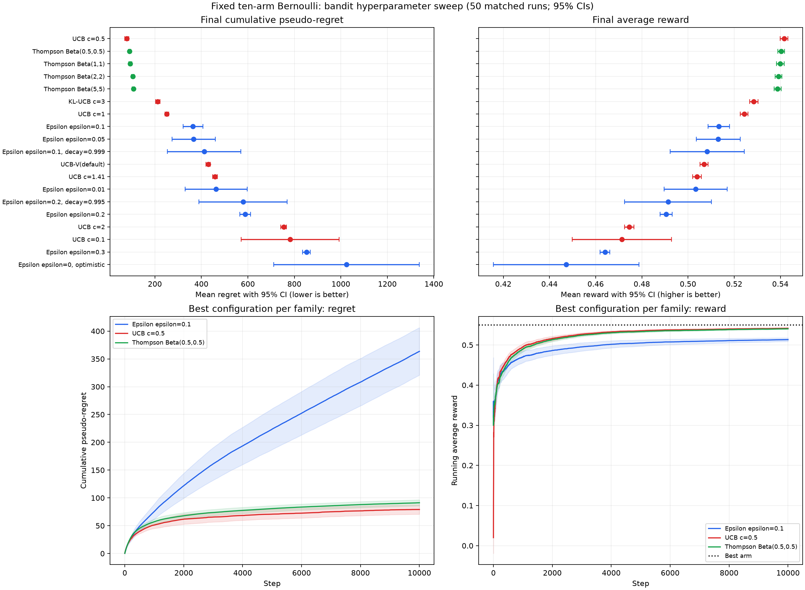

# RL by Hand

Small, interchangeable multi-armed bandit algorithms implemented with NumPy.

The core has three concepts:

```text
Algorithm  <── evaluation runner ──>  Problem
```

- `algorithms/`: one algorithm per file (epsilon-greedy, UCB, KL-UCB,
  variance-aware UCB, Beta-Bernoulli Thompson sampling, forgetting Thompson
  sampling, normal Thompson sampling, sliding-window UCB)
- `problems/`: reward-generating environments (stationary Bernoulli and
  Gaussian, plus drifting Bernoulli variants whose arm means random-walk at
  two drift rates)
- `evaluation/`: one shared runner, comparison API, and paired statistics
- `study/`: one reproducible multi-scenario comparison of the included
  algorithms, plus a regret-versus-horizon sweep

## Setup

Requirements: [uv](https://docs.astral.sh/uv/) and Python 3.12 or newer (the
repository pins the development version in `.python-version`).

```bash
# create .venv and install the locked dependencies (incl. pytest, ruff)
uv sync --locked

# verify the installation
uv run pytest
uv run ruff check .
```

To use the library directly:

```python
import numpy as np

from algorithms import UCB
from evaluation import run
from problems import BernoulliBandit

problem = BernoulliBandit(np.array([0.1, 0.25, 0.8]))
result = run(UCB(), problem, n_steps=1_000, seed=7)

print(result.average_reward)
print(result.total_regret)
print(result.total_pulls)
```

To compare several algorithms on matched random streams:

```python
from algorithms import UCB, EpsilonGreedy, ThompsonSampling
from evaluation import compare
from problems import BernoulliBandit

comparison = compare(
    {
        "epsilon-greedy": EpsilonGreedy(),
        "ucb": UCB(),
        "thompson": ThompsonSampling(),
    },
    BernoulliBandit(np.array([0.1, 0.25, 0.8])),
    n_steps=1_000,
    seeds=range(30),
)

for row in comparison.summaries():
    print(row.name, row.mean_reward, row.mean_regret)
```

Every algorithm sees the same problem and matched random seeds in each run.

## The study

One focused hyperparameter study instead of several overlapping benchmark
scripts. It evaluates **57 configurations across four scenarios** — for
10,000 steps over 50 matched runs each:

| Scenario | Problem | Arm-mean drift | Configs |
| --- | --- | --- | ---: |
| Bernoulli | fixed ten-arm, means 0.05–0.55 | none | 19 |
| Gaussian | fixed ten-arm, means −1…3.5, σ=1 | none | 11 |
| Drifting | ten-arm, random-walk means | 0.02 per step | 13 |
| Slowly drifting | ten-arm, random-walk means | 0.002 per step | 14 |

The stationary scenarios sweep epsilon-greedy (`epsilon`, decay, optimistic
initialization), UCB (`c` in `{0.1, 0.5, 1.0, sqrt(2), 2.0}`), KL-UCB,
variance-aware UCB, and Beta-Bernoulli / normal Thompson priors. The
drifting scenarios contrast fixed-epsilon and recency-weighted
(`step_size`) epsilon-greedy with stationary UCB/KL-UCB/Thompson references
and drift-aware variants (sliding-window UCB, forgetting Thompson sampling);
the slow-drifting variant drifts ten times slower so that walks stay
comparable to the arm spread over the horizon.

A companion sweep examines how the ranking depends on the horizon
(1,000, 10,000 and 100,000 steps, 6 configurations, 50 matched runs).

Run either with (each takes a few minutes):

```bash
uv run rl-study       # the four-scenario study
uv run rl-horizons    # the horizon sweep
```

## Results

### Stationary problems

Best configuration from each family on the fixed Bernoulli problem:

| Rank | Configuration | Mean reward | Mean pseudo-regret |
| ---: | --- | ---: | ---: |
| 1 | UCB `c=0.5` | 0.5417 ± 0.0017 | 79.17 ± 8.55 |
| 2 | Thompson `Beta(0.5, 0.5)` | 0.5404 ± 0.0015 | 91.24 ± 5.39 |
| 8 | Epsilon-greedy `epsilon=0.1` | 0.5133 ± 0.0046 | 363.57 ± 42.75 |

On the Gaussian problem the top two are a statistical tie (paired difference
-1.8 ± 25.6): UCB `c=1` at regret 75.1 ± 24.7 and Thompson-Normal `sigma0=2`
at 76.8 ± 5.6 are indistinguishable, while a too-narrow prior (`sigma0=0.5`)
is worst by a large margin (5,624.9). On the Bernoulli problem the top two
separate at this horizon: UCB `c=0.5` beats Thompson `Beta(0.5,0.5)` by a
paired regret difference of -12.1 ± 9.2 (winning 76% of matched seeds), and
the winning scale stays small — UCB `c=1`, `c=1.41`, and `c=2` reach regrets
of 251.4, 459.0, and 753.8. The "theoretically improved" UCB variants do not
help at this horizon: KL-UCB `c=3` (212.2, rank 6) loses to UCB `c=0.5` on
all 50 matched seeds (-133.1 ± 9.8), and variance-aware UCB (429.2 on
Bernoulli, 442.8 on Gaussian) also trails tuned UCB, because their
logarithmic exploration budgets are tuned for asymptopia.

Averages and per-seed win rates can disagree, though: on the Gaussian
problem UCB `c=1` beats `c=0.5` on average (paired -265 ± 331) yet wins only
8% of paired seeds, because `c=0.5` loses a few runs catastrophically (its
median regret is 31.5 against `c=1`'s 59.0).

### Non-stationary problems

On the fast-drifting problem recency weighting is decisive: epsilon-greedy
with `alpha=0.2` reaches regret 1015.8 ± 21.4, beats UCB `c=1.41`
(1077.5 ± 51.0) by -61.7 ± 49.8, beats UCB-V (1112.5, rank 3) and
sliding-window UCB (1208.1), and beats every fixed-epsilon configuration
(2,835–2,973) and stationary Thompson `Beta(1,1)` (2,688.8) on all 50
matched seeds. Adaptive Thompson helps: forgetting with `gamma=0.99` cuts
Thompson's drifting regret from 2,688.8 to 1,334.0, but stays behind
`alpha=0.2`.

On the slowly drifting problem the ordering inverts: stationary Thompson
`Beta(1,1)` (253.5) and KL-UCB (277.2; paired difference -23.7 ± 68.0, a tie)
win, sliding-window UCB with a 1,000-step window is third (357.6), while the
forgetting variants are catastrophic (`gamma=0.99`: 1,425.4; `gamma=0.95`:
2,391.1, last) and `alpha=0.2`, the fast-drift winner, drops to rank 11
(781.5). With ten times slower drift the arm means stay within the horizon,
so long-memory algorithms are right: decaying the posterior throws away
precisely the information that slow drift preserves. There is no universal
non-stationary algorithm: the right memory length is set by the drift rate.

### Horizon dependence

| Horizon | UCB `c=0.5` | Thompson `Beta(0.5,0.5)` | UCB `c=1.41` | Epsilon `ε=0.1` |
| ---: | ---: | ---: | ---: | ---: |
| 1,000 | 51.3 | 57.1 | 153.6 | 75.6 |
| 10,000 | 79.2 | 91.2 | 459.0 | 363.6 |
| 100,000 | 107.2 | 126.0 | 752.9 | 2,795.7 |

UCB `c=0.5` stays the Bernoulli winner at every horizon and its regret per
step collapses logarithmically (0.0513, 0.0079, 0.0011), while fixed-epsilon
`epsilon=0.1` keeps an almost constant per-step cost (0.0756, 0.0364, 0.0280).
The small UCB scale never loses its lead on this problem at these horizons:
`c=1.41` still trails 7-fold at 100,000 steps (752.9, 0.0075 per step).

### Statistics and reproducibility

Values after `±` are 95% confidence-interval half-widths. Because every run
shares its seed, each configuration is also compared with the scenario's best
configuration seed by seed; these paired differences are much more sensitive
than comparing independent intervals. `win_rate` is the fraction of seeds
where the paired difference is strictly positive, so ties count against the
configuration. These results apply to these finite-horizon problems; they
are not universal algorithm rankings.



The reproducible outputs are in `study/results/`:

- `study.json`: manifest with the git commit, run configuration, and grids
- `<scenario>/summary.csv`: all configurations ranked with confidence intervals
  and regret risk quantiles (median, p90, max)
- `<scenario>/per_run.csv`: outcomes for every configuration and seed
- `<scenario>/paired.csv`: per-seed paired differences against the best run
- `<scenario>/comparison.png`: endpoint rankings and best-per-family curves
- `horizons.csv`: the regret-versus-horizon sweep

with `<scenario>` one of `bernoulli`, `gaussian`, `drifting`, or
`slow_drifting`.

## Add an algorithm

Create `algorithms/my_algorithm.py` and implement `BanditAlgorithm`:

```python
class MyAlgorithm(BanditAlgorithm):
    @property
    def name(self) -> str: ...

    def reset(self, n_arms, rng) -> None: ...
    def select_arm(self, step: int) -> int: ...
    def update(self, arm: int, reward: float) -> None: ...

    @property
    def estimated_values(self): ...

    @property
    def total_pulls(self): ...
```

Export it from `algorithms/__init__.py`, add an isolated
`tests/algorithms/test_my_algorithm.py`, and include its factory in
`tests/algorithms/test_contract.py`. It can then be passed directly to `run`
or `compare`; no simulation loop or benchmark adapter is needed.

## Layout

```text
.
├── algorithms/
│   ├── base.py
│   ├── epsilon_greedy.py
│   ├── forgetting_thompson.py
│   ├── klucb.py
│   ├── sliding_window_ucb.py
│   ├── thompson.py
│   ├── thompson_normal.py
│   ├── ucb.py
│   └── ucb_variance.py
├── problems/
│   ├── base.py
│   ├── bernoulli.py
│   ├── drifting.py
│   └── gaussian.py
├── evaluation/
│   ├── comparison.py
│   └── runner.py
├── study/
│   ├── compare.py
│   ├── horizons.py
│   └── results/
│       ├── bernoulli/
│       ├── drifting/
│       ├── gaussian/
│       └── slow_drifting/
└── tests/
```
